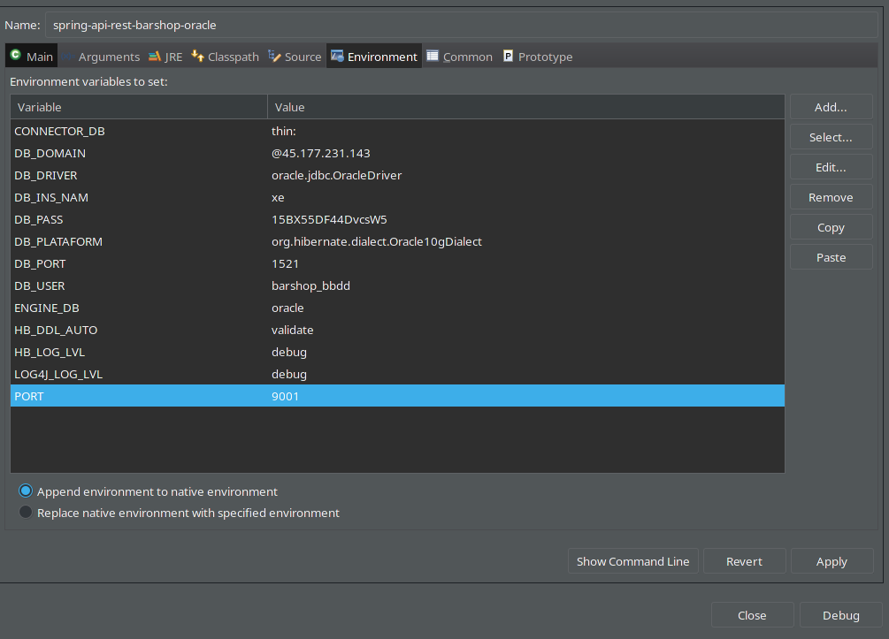
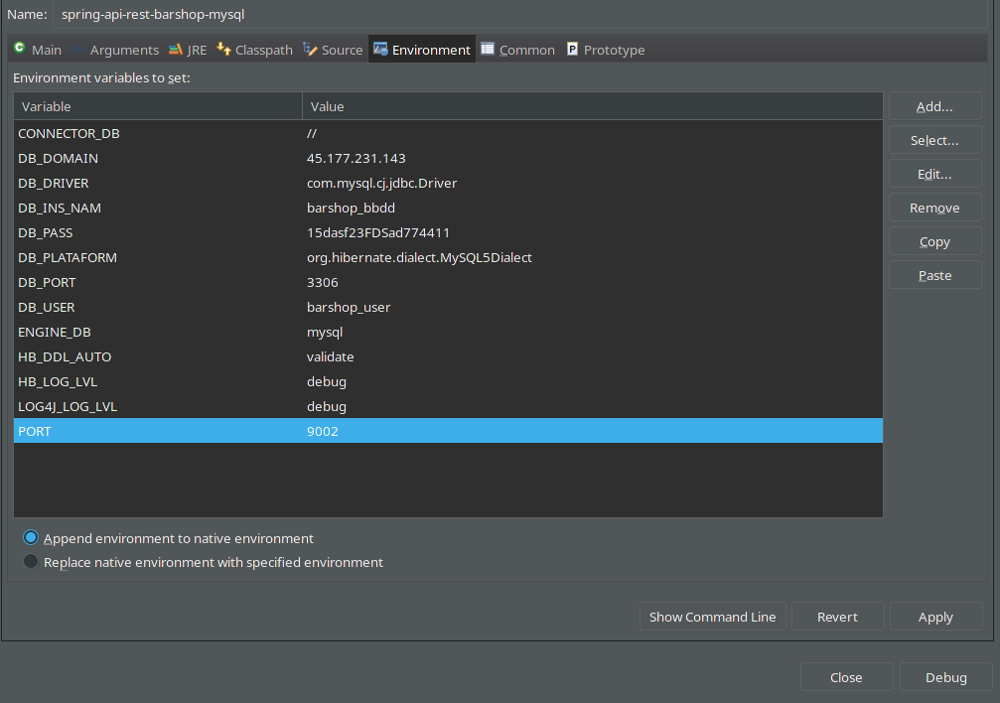
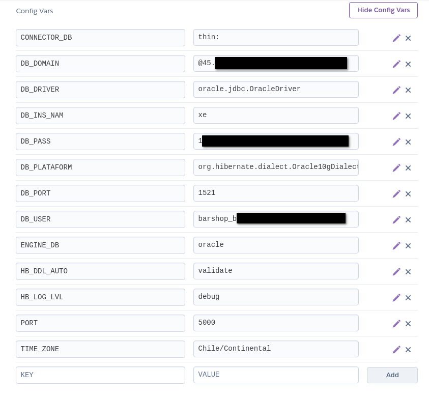
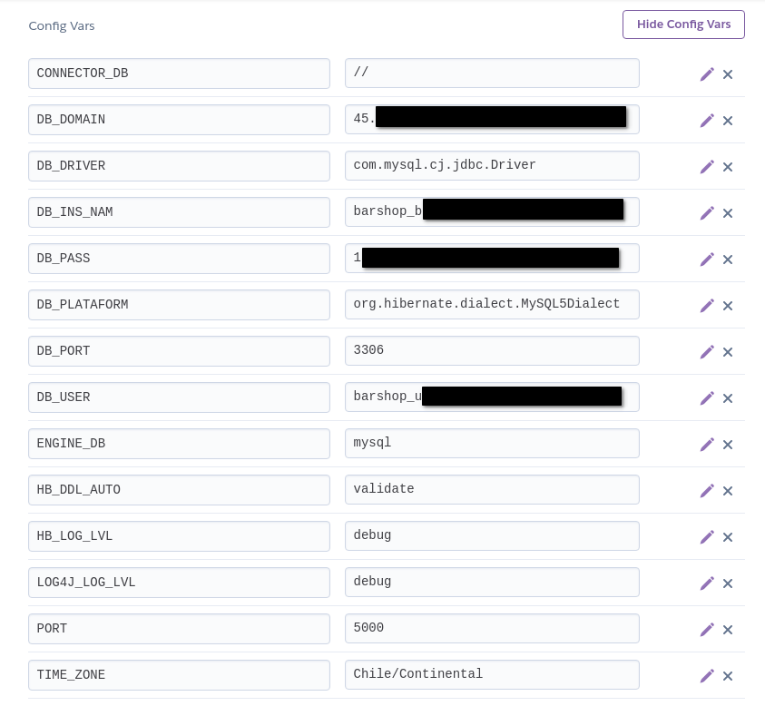
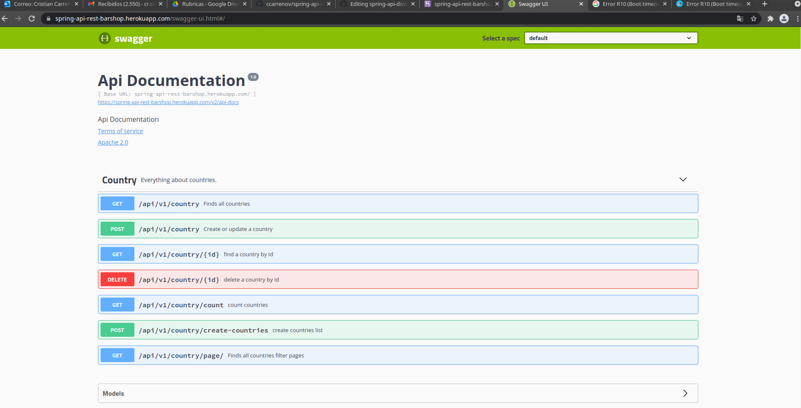

# spring-api-rest-peluqueria
Project web service scheme BarShop.

# Configuration data base.

## ENVIRONMENT VALUES:

| ENGINE | ENGINE_DB | CONNECTOR_DB | DB_DOMAIN | DB_PORT | DB_INS_NAM | DB_USER | DB_PASS |
| ------------- | ------------- |------------- |------------- |------------- |------------- |------------- |------------- |
| #ORACLE | oracle | thin: | @192.168.1.1 | 1521 | xe | barshop_bbdd | 15B8ijW21DcsPCSwsax392
| #MySQL | mysql | // | 192.168.1.1 | 3306 | barshop_bbdd | barshop_user | 15B8ijW21DcsPCSwsax392

## ENVIRONMENT ECLIPSE

ORACLE

CONNECTOR_DB=thin:

DB_DOMAIN=@192.168.1.1

DB_INS_NAM=xe

DB_PASS=15XXXXXXXXXXXXXX

DB_PORT=1521

DB_USER=barshop_bbdd

ENGINE_DB=oracle

MySQL

CONNECTOR_DB=//

DB_DOMAIN=@192.168.1.1

DB_INS_NAM=barshop_bbdd

DB_PASS=15XXXXXXXXXXXXXX

DB_PORT=3306

DB_USER=barshop_user

ENGINE_DB=mysql

## ENVIRONMENT JVM

| ENGINE | COMMAND |
| ------------- | ------------- |
| ORACLE | -DENGINE_DB=oracle -DCONNECTOR_DB=thin: -DDB_DOMAIN=@192.168.1.1 -DDB_PORT=1521 -DDB_INS_NAM=xe -DDB_USER=barshop_bbdd -DDB_PASS=15XXXXXXXXXXXXXX |
| MySQL | -DENGINE_DB=oracle -DCONNECTOR_DB=// -DDB_DOMAIN=@192.168.1.1 -DDB_PORT=3306 -DDB_INS_NAM=barshop_bbdd -DDB_USER=barshop_user -DDB_PASS=15XXXXXXXXXXXXXX |

## HEROKU CONFIGURATION

### ORACLE

### MYSQL

## SWAGGER UI

### ORACLE

https://spring-api-rest-barshop-oracle.herokuapp.com/

### MYSQL

https://spring-api-rest-barshop-mysql.herokuapp.com/

